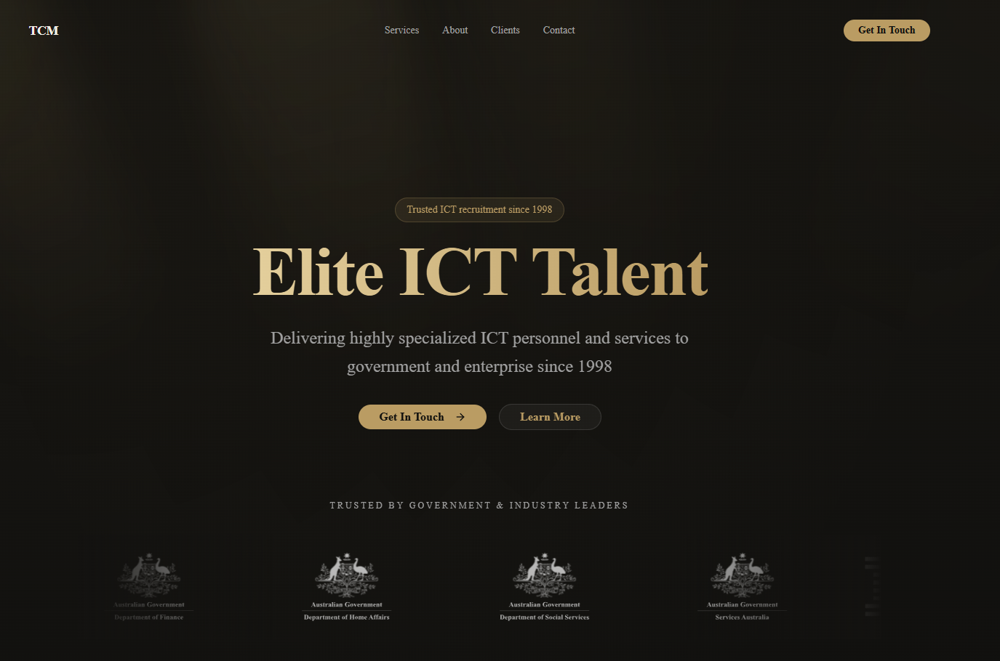

# TCM — ICT Consultancy Website

A modern, high-end website for an ICT consultancy firm, designed to reflect precision, credibility, and professionalism.

Built with a strong focus on clean design, smooth animations, and responsive user experience, this project showcases a boutique consultancy brand through a polished digital presence.

## Live Demo

👉 [TCM Website](https://tcm-rho.vercel.app)

## Preview



## Tech Stack

- **Framework:** Next.js 16
- **Language:** TypeScript
- **Styling:** Tailwind CSS + ShadCN UI
- **Animations:** Framer Motion
- **Icons:** Lucide React
- **Fonts:** Geist (next/font)

## ✨ Features

- Glassmorphic sticky navbar with scroll behavior
- Animated hero, sections, and cards (blur + motion)
- Responsive layout (mobile-first)
- Bento-style capability grid
- Clean, structured footer
- Modern UI system using design tokens

## ⚙️ Getting Started

This project is built with **Next.js**.

### 1. Install dependencies

```bash
npm i
```

### 2. Run the development server:

```bash
npm run dev
# or
yarn dev
# or
pnpm dev
# or
bun dev
```

### 3. Open in browser

Open [http://localhost:3000](http://localhost:3000) with your browser to see the result.

You can start editing the page by modifying `app/page.tsx`. The page auto-updates as you edit the file.

### 4. Build before deployment!

```bash
npm run build
npm start
```
